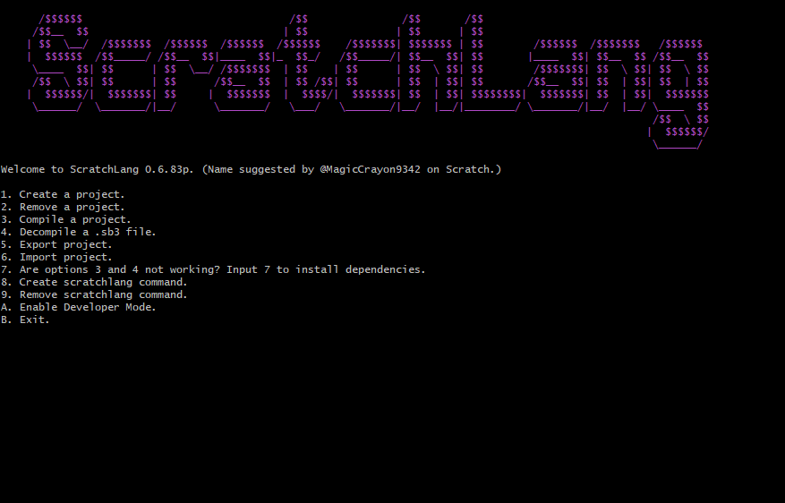

#  **Version 0.6.83p**

###### Logo by [MagicCrayon9342](https://scratch.mit.edu/users/MagicCrayon9342/)
[link to discussion forum](https://scratch.mit.edu/discuss/topic/629954/)

This is for people who want to use Scratch like other programming languages.

Also, a devlog is at the bottom.

---

# Latest big updates
Transitioned to almost 100% Python. Decompilers are still there, and created `createsl.sh` to make the scratchlang command.

# The bug list
is at the very bottom. Look at that list before posting bugs.

# Open-Source
This is an open-source project. Anyone can contribute. If there's anything discouraging you from contributing, let me know and I'll try to fix it.

# The Plan
This is mainly made in Python, but if you know languages like C, then you can make some stuff in that so people have many options to choose from.

Some .sb3 files are included in the resources folder so you can test your comp/decomp scripts.

The compiler should read the testcode.ss1, write the project.json, and pack it and every asset into a .sb3, that can be played and edited in Scratch

Each sprite (including Stage) has a asset folder. The costumes and sound will go there. It also has a .ss1 file, which is where the code is.

A project.json is also included in the resources folder to help understand and reverse engineer how it's made. Although, there is pretty much nothing in it, so I recommend getting your own project.json

I'm programming the decompiler. First I'm gonna program it to decompile all the global and stage-exclusive blocks, then sprite-exclusive blocks.

## Contributing
I am currently putting comments in my code so people understand it. So for some sections, you will have to guess what the bash does. Sorry.
# Notice
Right now the default decompiler is set to the Python version. If you want to use the Shell Script version, follow these steps.

  1. Run scratchlang, then press A to enable developer mode
  2. Press D to change the decompilation script.
  3. Press 1 to pick one of the included scripts, then press 2 to select Decompiler V2.

Also, I renamed the file extension to .ss1 because I am planning on having multiple formats.<br>
ss1 Will be it's own language<br>
ss2 Will be similar to c<br>
ss3 Python or javascript?<br>

# How to use
Download [MSYS2](https://www.msys2.org) if you're on Windows.<br>

Install dependencies (list below).

Clone the repo with
```
git clone https://github.com/ScratchLang/ScratchLang.git
cd ScratchLang/mainscripts
```

Start the project with
```
python3 scratchlang.py
```
If you create a scratchlang command, start the project wtih
```
scratchlang
```

If you want to test out the decompiler, run `python3 scratchlang.py -4` and select the .sb3 "every-block-+-pen.sb3" which is in the resources folder. You get to see it decompile all the blocks added so far.

To code, edit the .ss(es) in you favorite glorified text editor like VSC or Atom.

To add assets, put them in the "assets" folder for the chosen sprite (or stage)

You don't need ScratchLang to program ScratchScript (.ss) files, you can use a text editor. You just need ScratchLang to compile your project so it can run in Scratch.

# Dependencies
## Windows
You need `zenity` ONLY IF YOU ARE PLANNING TO USE THE VERSION MADE IN SHELLSCRIPT.
Download [here](https://github.com/ncruces/zenity/wiki/Zenity-for-WSL%2C-Cygwin%2C-MSYS2), or you can go into the old_scripts directory and run ./start.sh and input 7 to install zenity.

You also need these.
```
pacman -S python git bc unzip
```
## Linux
You need the command `zenity` ONLY IF YOU ARE PLANNING TO USE THE VERSION MADE IN SHELLSCRIPT.
```
sudo apt-get install -y zenity
```
You also need these.
```
sudo apt-get install -y python
sudo apt-get install -y git
sudo apt-get install -y bc
sudo apt-get install -y unzip
```
## Other Linux Distros
For any other distros, search it up. I'm not gonna list the commands for every distro.

Please write down any dependencies I missed.

# Jobs
This is what people will do.

### 0K9090
Program the decompiler in Python
### stan-solov
Make the docs
### wendiner
I don't know what they're doing
### redstone-scratch
They quit :/ Goodbye

# ScratchLang Language
ScratchLang's language is called ScratchScript.
## ScratchScript blocks
\nscript - (Tells the compiler that it's a new script. Or maybe we could get rid of this and just detect for hat blocks.)<br>
**\prep - (Everything below this [until the next instance of \nscript] is used for compiling the .json)**<br>
list=item1, item2, item3, etc - (For an empty list, just add a comma after the equal sign.)<br>
**{broadcast}=broadcastexample - (Define a broadcast. The brackets tell the program that it is not defining a variable or a list.)**<br>
var=string - (Define a variable)<br>
# Decompiler Python V1
## Vanilla Scratch Blocks
What I'm counting as Vanilla Scratch Blocks:
Normal Blocks
Custom Blocks
Pen extension
### Added blocks
78/80 Stage Blocks + Pen | 90.00% Done<br> # Only Custom Blocks left!
78/139 Every Block + Pen | 51.80% Done<br>

Write every block in the order they are defined.<br>

Remember, quotes tell the compiler that it is not a variable. If you want to put in a variable, don't put quotation marks.<br>
Also, the compiler can't tell the difference between a string and an input (like a variable) yet. So most inputs have quotation marks.<br>

Brackets means that there cannot be a variable in there. It's either a defined object or an object from a set list.<br>
### Buggy Blocks
None yet.
### Stable blocks
Just decompile the "every-block-+-pen.sb3" which is in the resources folder.<br>
You will get an unknown block error for blocks that the decompiler can't read yet.<br>
Every other block is most likely a stable block

# Limitations
Lots, because It's not finished.

### Blocks to Add
Too lazy to make a "Blocks to Add" list :/

# Decompiler V2 Blocks
## Vanilla Scratch Blocks
### Added blocks
39/90 Stage Blocks + Pen | 43.33% Done<br>
39/141 Every Block + Pen | 27.66% Done<br>

Write every block in the order they are defined.<br>

Remember, quotes tell the compiler that it is not a variable. If you want to put in a variable, don't put quotation marks.<br>
Also, the compiler can't tell the difference between a string and an input (like a variable) yet. So most inputs have quotation marks.<br>

Brackets means that there cannot be a variable in there. It's either a defined object or an object from a set list.<br>
### Buggy Blocks
None yet.
### Stable blocks
var=string - (Define [or set] a variable)<br>
**list=item1,item2,item3,etc - (Overwrites anything in a list to the items listed. No spaces, and for an empty list, just add a comma after the equal sign.)**<br>
move ("num") steps (Move an amount of steps.)<br>
**wait ("num") seconds - (Wait for an amount of seconds.)**<br>
switch backdrop to ("backdrop") - (Changes backdrop.)<br>
**switch backdrop to ("backdrop") and wait -  (Changes backdrop and waits.)**<br>
next backdrop - (Changes backdrop by 1.)<br>
**change [EFFECT #has to be in caps] effect by ("num") - (Change an effect by an amount.)**<br>
set [EFFECT] effect to ("num") - (Sets an effect to an amount.)<br>
**clear graphic effects - (Clears all effects applied to the stage or sprite.)**<br>
(backdrop [number/name]) - (Reports the number or name of the backdrop.)<br>
**play sound ("sound") until done - (Play a sound until done.)**
start sound ("sound") - (Start a sound.)<br>
**stop all sounds (Stop all sounds.)**<br>
change [EFFECT] effect by ("num") (Change an effect by an amount.)<br>
**set [EFFECT] effect to ("num") - (Sets an effect to an amount.)**<br>
clear sound effects - (Clear sound effects.)<br>
**change volume by ("num") - (Change the volume by an amount.)**<br>
set volume to ("num") % - (Set the volume to an amount.)<br>
**(volume) - (Reports the volume.)**<br>
when flag clicked - (When green flag clicked.)<br>
**when [key] key pressed - (Runs the script when a certain key is pressed.)**<br>
when stage clicked - (Runs the script when the stage is clicked.)<br>
**when backdrop switches to [backdrop] - (Runs the script when the stage changes to a certain backdrop.)**<br>
when [THING] > ("num")<br>
**when i receive [broadcast] - (Runs the script when a certain message is broadcasted.)**<br>

repeat (num) {<br>

} - (Repeat everything in the braces for (num) times.)<br>

**forever {**<br>

**} - (Repeat everything in the braces forever.)**<br>

if \<INPUT\> then {<br>

} - (If \<INPUT\> is true, then run everything in the braces.)<br>

**<(num1) = (num2)> - (Reports true if num1 equals num2.)**<br>
<(num1) > (num2)> - (Reports true if num1 is greater than num2.)<br>
**<(num1) < (num2)> - (Reports true if num1 is less than num2.)**<br>
<<1> and <2>> - (Reports true if both statement 1 and 2 report true.)<br>
**<<1> or <2>> - (Reports true if either statement report true.)**<br>
<not <1>> - (Reports true if statement 1 is false.)<br>

**if \<INPUT\> then {**<br>

**} else {**<br>

**} - (If \<INPUT\> is true, run the stuff above the else. If it is not, run the stuff below the else.)**<br>
wait until \<INPUT\> - (Pause the script until \<INPUT\> is true.)<br>


**repeat until \<INPUT\> {**<br>

**} - (Repeat everything in the braces until \<INPUT\> is true.)**<br>

while \<INPUT\> {<br>

} - (Repeat everything in the braces while \<INPUT\> is true. Stop when it is false.)<br>

# Limitations
The decompiler cannot decompile boolean blocks ( <> blocks) which are inside other ones.
You can't have variables or any round block as inputs yet.

### Blocks to Add

turn cw () deg<br>
turn ccw () deg<br>
go to ()<br>
go to x () y ()<br>
glide () secs to ()<br>
glide () secs to x () y ()<br>
point in direction ()<br>
point towards ()<br>
change x by ()
set x to ()<br>
change y by ()<br>
set y to ()<br>
if on edge, bounce<br>
set rotation style []<br>
(x position)<br>
(y position)<br>
(direction)<br>

say () for () seconds<br>
say ()<br>
think () for () seconds<br>
think ()<br>
switch costume to ()<br>
next costume<br>
change size by ()<br>
set size to ()<br>
show<br>
hide<br>
go to [] layer<br>
go [] () layers<br>
(costume [])<br>
(size)<br>

for each [] in () {<br>

}<br>

stop []<br>
when i start as a clone<br>
create clone of ()<br>
delete this clone<br>

<touching ()><br>
<touching color (#hex)><br>
<color (#hex) is touching (#hex)><br>
(distance to ())<br>
ask () and wait<br>
(answer)<br>
<key () pressed?><br>
<mouse down?><br>
(mouse x)<br>
(mouse y)<br>
set drag mode []<br>
(loudness)<br>
(timer)<br>
reset timer<br>
([] of ())<br>
(current [])<br>
(days since 2000)<br>
(username)<br>

(() + ())<br>
(() - ())<br>
(() * ())<br>
(() / ())<br>
(pick random () to ())<br>
(join ()())<br>
(letter () of ())<br>
(length of ())<br>
<() contains ()?><br>
(() mod ())<br>
(round ())<br>
([] of ()) #abs of block<br>

(my variable)<br>
change [] by ()<br>
show variable []<br>
hide variable []<br>
(my list)<br>
add () to []<br>
delete () of []<br>
delete all of []<br>
insert () at () of []<br>
replace item () of [] with ()<br>
(item () of [])<br>
(item # of () in [])<br>
(length of [])<br>
<[] contains ()?> #list contains block
show list []<br>
hide list []<br>

def example {<br>

}<br>

def example -sr { #run without screen refresh<br>

}<br>
example<br>

pen|erase all<br>
pen|stamp<br>
pen|pen down<br>
pen|pen up<br>
pen|set pen color to (#hex)<br>
pen|change pen () by ()<br>
pen|set pen () to ()<br>
pen|change pen size by ()<br>
pen|set pen size to ()<br>

# Decompiler V1 Blocks
V1 is officialy deprecated. Please use the latest version of the decompiler.
## Vanilla Scratch Blocks
### Added blocks
25/90 Stage Blocks + Pen | 27.78% Done<br>
25/141 Every Block + Pen | 17.73% Done<br>

Write every block in the order they are defined.<br>

Remember, quotes tell the compiler that it is not a variable. If you want to put in a variable, don't put quotation marks.<br>
Also, the compiler can't tell the difference between a string and a boolean/variable yet. So most number inputs have no quotation marks.<br>

Brackets means that there cannot be a variable in there. It's either a defined object or an object from a set list.<br>
### Very buggy blocks
repeat ("num") {<br>

} - (Repeat everything in the braces for (num) times.)<br>

**forever {**<br>

**} - (Repeat everything in the braces forever.)**<br>

### Stable blocks
var=string - (Define [or set] a variable)<br>
**list=item1,item2,item3,etc - (No spaces, and for an empty list, just add a comma after the equal sign.)**<br>
move ("num") steps (Move an amount of steps.)<br>
**wait ("num") seconds - (Wait for an amount of seconds.)**<br>
switch backdrop to ("backdrop") - (Changes backdrop.)<br>
**switch backdrop to ("backdrop") and wait -  (Changes backdrop and waits.)**<br>
next backdrop - (Changes backdrop by 1.)
**change [EFFECT #has to be in caps] effect by ("num") - (Change an effect by an amount.)**<br>
set [EFFECT] effect to ("num") - (Sets an effect to an amount.)<br>
**clear graphic effects - (Clears all effects applied to the stage or sprite.)**<br>
(backdrop [number/name]) - (Reports the number or name of the backdrop.)<br>
**play sound ("sound") until done - (Play a sound until done.)**
start sound ("sound") - (Start a sound.)<br>
**stop all sounds (Stop all sounds.)**<br>
change [EFFECT] effect by ("num") (Change an effect by an amount.)<br>
**set [EFFECT] effect to ("num") - (Sets an effect to an amount.)**<br>
clear sound effects - (Clear sound effects.)<br>
**change volume by ("num") - (Change the volume by an amount.)**<br>
set volume to ("num") % - (Set the volume to an amount.)<br>
**(volume) - (Reports the volume.)**<br>
when flag clicked - (When green flag clicked.)<br>
**when [key] key pressed - (Runs the script when a certain key is pressed.)**<br>
when stage clicked - (Runs the script when the stage is clicked.)<br>
**when backdrop switches to [backdrop] - (Runs the script when the stage changes to a certain backdrop.)**<br>
when [THING] > ("num")<br>
**when i receive [broadcast] - (Runs the script when a certain message is broadcasted.)**<br>

### Blocks to Add

turn cw () deg<br>
turn ccw () deg<br>
go to ()<br>
go to x () y ()<br>
glide () secs to ()<br>
glide () secs to x () y ()<br>
point in direction ()<br>
point towards ()<br>
change x by ()
set x to ()<br>
change y by ()<br>
set y to ()<br>
if on edge, bounce<br>
set rotation style []<br>
(x position)<br>
(y position)<br>
(direction)<br>

say () for () seconds<br>
say ()<br>
think () for () seconds<br>
think ()<br>
switch costume to ()<br>
next costume<br>
change size by ()<br>
set size to ()<br>
show<br>
hide<br>
go to [] layer<br>
go [] () layers<br>
(costume [])<br>
(size)<br>

if <> then {<br>

}<br>

if <> then {<br>

}<br>
else {<br>

}<br>

wait until <><br>
repeat until <> {<br>

}<br>

while <> {<br>

}<br>

for each [] in () {<br>

}<br>

stop []<br>
when i start as a clone<br>
create clone of ()<br>
delete this clone<br>

<touching ()><br>
<touching color (#hex)><br>
<color (#hex) is touching (#hex)><br>
(distance to ())<br>
ask () and wait<br>
(answer)<br>
<key () pressed?><br>
<mouse down?><br>
(mouse x)<br>
(mouse y)<br>
set drag mode []<br>
(loudness)<br>
(timer)<br>
reset timer<br>
([] of ())<br>
(current [])<br>
(days since 2000)<br>
(username)<br>

(() + ())<br>
(() - ())<br>
(() * ())<br>
(() / ())<br>
(pick random () to ())<br>
<() > ()><br>
<() < ()><br>
<() = ()><br>
<<> and <>><br>
<<> or <>><br>
<not <>><br>
(join ()())<br>
(letter () of ())<br>
(length of ())<br>
<() contains ()?><br>
(() mod ())<br>
(round ())<br>
([] of ()) #abs of block<br>

(my variable)<br>
change [] by ()<br>
show variable []<br>
hide variable []<br>
(my list)<br>
add () to []<br>
delete () of []<br>
delete all of []<br>
insert () at () of []<br>
replace item () of [] with ()<br>
(item () of [])<br>
(item # of () in [])<br>
(length of [])<br>
<[] contains ()?> #list contains block
show list []<br>
hide list []<br>

def example {<br>

}<br>

def example -sr { #run without screen refresh<br>

}<br>
example<br>

pen|erase all<br>
pen|stamp<br>
pen|pen down<br>
pen|pen up<br>
pen|set pen color to (#hex)<br>
pen|change pen () by ()<br>
pen|set pen () to ()<br>
pen|change pen size by ()<br>
pen|set pen size to ()<br>

# Troubleshooting
## Variable or List taking a very long time to decompile?
The variable or list is probably long.
## Decompiler is hanging or is outputting random junk
The decompiler is not complete yet, which means stuff like that may happen.
## Decompiler takes a really long time to indent
Your .ss1 file is probably big.
# Bugs
## V1 Decomp Bugs (This version is deprecated.)
* Loads broadcasts even if there are none. (Try decompiling decompilertest.sb3 which is in the resources folder.)
## V2 Decomp Bugs
* Sometimes (in the project.json) when decompiling a "switch backdrop to" block, the backdrop name is replaced with a number, causing some bugs.
* Sometimes blocks don't compile at the right place if it's after a c-block.
## Python V1 Bugs
* None yet.



# Devlog
Format: MM.DD.YY - VERSION
## 11.3.22 - 0.6.83p
* ScratchLang is not almost 100% Python.
## 10.??.22 - 0.6.82p
* Forgot to make a devlog for this day, so I forgot what I added in this version
## 10.29.22 - 0.6.81p
* Added some more blocks to the python port.
## 10.28.22 - 0.6.8p
* Added some blocks to the python port.
## 10.27.22 - 0.6.84a
* Started the Python port.
## 10.24.22 - 0.6.83a
* Using shellcheck, I optimized the scripts to go faster.
## 10.19.22 - 0.6.82a
* repeat until block added.
* while block added.
## 10.13.22 - 0.6.81a
* wait until <> block added.
## 10.12.22 - 0.6.8a
* If/elses inside if/elses work perfectly.
## 10.11.22 - 0.6.71a
* Nothing major, forgot what I added.
## 10.10.22 - 0.6.7a
* Added a Devlog :)
* added if/else blocks and not operator