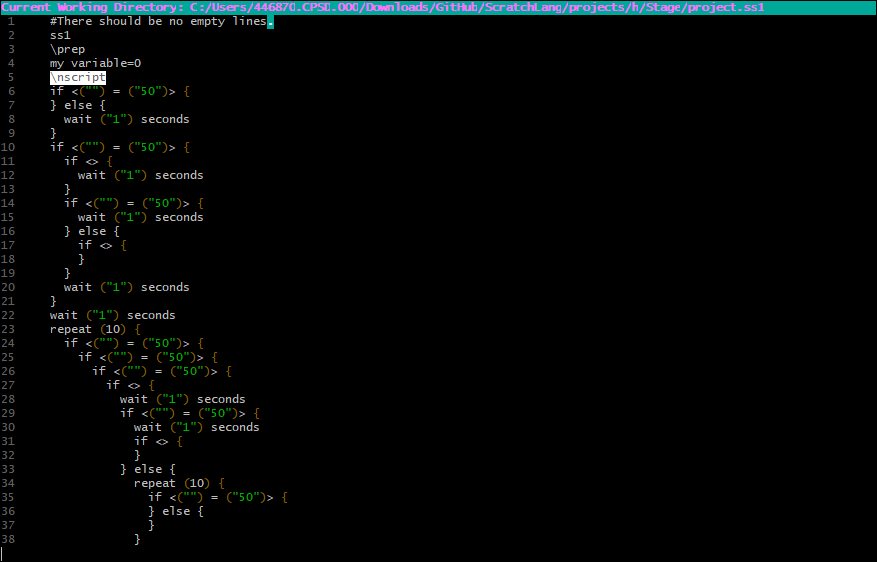

#  **Version 0.6.89p**

Logo by [MagicCrayon9342](https://scratch.mit.edu/users/MagicCrayon9342/)

[link to discussion forum](https://scratch.mit.edu/discuss/topic/629954/)

This is for people who want to use Scratch like other programming languages.

Also, a devlog is in the releases. If the version is not in the releases, then it's most likely at the bottom of this readme, at the old devlog.

---

## Latest big updates

The editor is looking really good, and the decompiler can decompile every sprite (including the stage) and add all the assets.

## The bug list

is at the very bottom. Look at that list before posting bugs.

## Open-Source

This is an open-source project. Anyone can contribute. If there's anything discouraging you from contributing, let me know, and I'll try to fix it.

## The Plan

This is mainly made in Python, but if you know languages like C, then you can make some stuff in that so people have many options to choose from.

Some .sb3 files are included in the resources folder, so you can test your comp/decomp scripts.

The compiler should read the project.ss1, write the project.json, and pack it and every asset into a .sb3, that can be played and edited in Scratch

Each sprite (including Stage) has an asset folder. The costumes and sound will go there. It also has a .ss1 file, which is where the code is.

A project.json is also included in the resources folder to help understand and reverse engineer how it's made. Although, there is pretty much nothing in it, so I recommend getting your own project.json

I'm programming the decompiler. First I'm going to program it to decompile all the global and stage-exclusive blocks, then sprite-exclusive blocks.

## Contributing

I am currently putting comments in my code so people understand it. So for some sections, you will have to guess what the code does. Sorry.

## Notice

Right now the default decompiler is set to the Python version. If you want to use the Shell Script version, follow these steps.

1. Run scratchlang, then press A to enable developer mode
2. Press D to change the decompilation script.
3. Press 1 to pick one of the included scripts, then press 2 to select Decompiler V2.

Also, I renamed the file extension to .ss1 because I am planning on having multiple formats.  
ss1 Will be its own language **Current**  
ss2 Will be similar to c  
ss3 Python or javascript? **These 2 won't be worked on anytime soon**

## How to use

Download [MSYS2](https://www.msys2.org) if you're on Windows.

Install dependencies (list below).
Make sure you have pip installed as well, then install the requirements after cloning the repository. (command below.)

Clone the repo with

```sh
git clone https://github.com/ScratchLang/ScratchLang.git
cd ScratchLang/mainscripts
```

Start the project with

```sh
py scratchlang.py
```

OR

```sh
python scratchlang.py
```

OR

```sh
python3 scratchlang.py
```

Depending on which version of python you install.

If you create a scratchlang command, start the project wtih

```sh
scratchlang
```

If you want to test out the decompiler, run `py scratchlang.py -4` and select the .sb3 "every-block-+-pen.sb3" which is in the resources folder. You get to see it decompile all the blocks added so far.

To code, edit the .ss(es) in you favorite glorified text editor like VSC or Atom.  
**Or, you can use ScratchLang's custom editor :D**

To add assets, put them in the "assets" folder for the chosen sprite (or stage)

## Editor

One day I randomly decided to make an editor for ScratchLang. And here it is. It's not finished, but I'd still say it's kinda decent.

The editor is made completely in Python.

### Edit in the custom editor

Start the editor with

```sh
py editor.py
```

You can even have the path to your project folder as the 1st argument to avoid the folder select screen and go straight to the editor.

### Editor controls

- Arrow keys: Move around
- You can also click to place the mouse pointer.
- ctrl+s: Save project
- ctrl+/: Toggle line comment
- caps lock: Caps lock. Duh!
- tab: Insert a tab.
- Page Up and Page Down: Quickly navigate through your code
- F1: Open another folder or project.ss1
- F2: New Sprite

### Editor settings

You can go into the var/ directory and edit the 'editor_settings.yaml' file to change your settings.

Settings added so far:

- tabsize: N - Set the tabsize to N
- syntax_highlighting: True/False - Turn syntax highlighting on or off. **_Does not work yet._**
- show_cwd: True/False - Show or hide the current working directory.
- theme: Dark/Light/Black/RGB - Theme can be dark, light, black, or you can customize the theme with tr, tg, and tb with RGB colors (listed below)
- tr: N - Set RED to N
- tg: N - Set GREEN to N
- tb: N - Set BLUE to N

### Added Features so far

- Syntax Highlighting
- Scuffed quote and bracket auto-complete
- Auto-indent
- Dark, Light, and custom RGB themes

### Planned features

- Project folder explorer

## Dependencies

### Windows

#### MSYS2/MINGW64

You need `zenity` ONLY IF YOU ARE PLANNING TO USE THE VERSION MADE IN SHELLSCRIPT.  
Download [here](https://github.com/ncruces/zenity/wiki/Zenity-for-WSL%2C-Cygwin%2C-MSYS2), or you can go into the old_scripts directory and run ./start.sh and input 7 to install zenity.  

You also need these.

```sh
pacman -S python3 git bc unzip # bc is an optional dependency, so you don't have to install it.
```

#### Command Prompt/Powershell

Command Prompt and Powershell isn't recommened to run ScratchLang, but you can if you want. But if you have the ability to install MSYS2, then use that instead.  
Anyway, I don't have a quick and easy way to install the dependencies. All I know is this:

- Install [Python](https://python.org)
- Install git for windows (I don't have a link yet)
- Get a windows binary of unzip and add it to the PATH environment variable.  

Then, you need to enable ANSI escape codes (in order for things like color to work properly).

- Press the Windows button and search for 'Registry Editor'
- Click on 'HKEY_CURRENT_USER'
- Click on 'Console'
- Then click 'Edit > New > DWORD (32 bit) value'
- Name the value 'VirtualTerminalLevel'
- Then double click it and set the value to '1'  

Now ANSI escape sequences should be enabled for Command Prompt/Powershell.

In order for the 'click to place text cursor' thing to work... well... sort of properly, you're going have to right click the window, click properties, then uncheck the 'Quick Edit Mode' box.

However, it doesn't really work for command prompt, as the lower the line you click on, the more off-target it is.

#### pip requirements

Once you've installed those, you'll need to install pip. (Most of the time pip is installed with Python, though.)  
Then install the requirements.txt with:

```sh
pip install -r requirements.txt
```

### Linux

You need the command `zenity` ONLY IF YOU ARE PLANNING TO USE THE VERSION MADE IN SHELLSCRIPT.

```sh
sudo apt-get install -y zenity
```

You also need these.

```sh
sudo apt-get install -y python3
sudo apt-get install -y git
sudo apt-get install -y bc # Optional dependency, you can skip and it won't affect anything.
sudo apt-get install -y unzip
```

Once you've installed those, you'll need to install pip then install the requirements.txt with:

```sh
pip install -r requirements.txt
```

### Other Linux Distros

For any other distros, search it up. I'm not going to list the commands for every distro.

Please write down any dependencies I missed.

## Jobs

This is what people will do.

### 0K9090

Program the decompiler in Python (and work on the editor!)

### wendiner

I don't know what they're doing

### redstone-scratch

They quit :/ Goodbye

### stan-solov

Develop the Documentation website

## ScratchLang Language

ScratchLang's language is called ScratchScript.

### ScratchScript blocks

\nscript - (Tells the compiler that it's a new script. Or maybe we could get rid of this and just detect for hat blocks.)  
**\prep - (Everything below this [until the next instance of \nscript] is used for compiling the .json)**  
list: foo=item1, item2, item3, etc - (For an empty list, just add a comma after the equal sign.)  
**broadcast: broadcastexample - (Define a broadcast. The brackets tell the program that it is not defining a variable or a list.)**  
var: foo=string - (Define a variable)  
**//!\<TYPE\> - (Use sha-bangs after a block to set the block type to the desired one if it's not right. For example, replace \<TYPE\> with 'looks' to make it a looks block. This also changes the syntax highlighting in the editor.)**

### sha-bangs

- //!looks
- //!var
- //!list
- //!events
- //!sound
- //!control

## Decompiler Python V1

### Vanilla Scratch Blocks

What I'm counting as Vanilla Scratch Blocks:  
Normal Blocks  
Custom Blocks  
Pen

### Added blocks

78/80 Stage Blocks + Pen | 90.00% Done **Only Custom Blocks left!**  
78/139 Every Block + Pen | 51.80% Done

Write every block in the order they are defined.

Remember, quotes tell the compiler that it is not a variable. If you want to put in a variable, don't put quotation marks. Example:

```txt
switch backdrop to ("i") # 'i' is registered as a string

switch backdrop to (i) # 'i' is registered as a variable
```

Also, the compiler can't tell the difference between a string and an input (like a variable) yet. So most inputs have quotation marks.

When a block has brackets '[ ]' it means that there cannot be a variable in there. It's either a defined object or an object from a set list.

### Buggy Blocks

None yet.

### Stable blocks

Just decompile the "every-block-+-pen.sb3" which is in the resources folder.  
You will get an unknown block error for blocks that the decompiler can't read yet.  
Every other block is most likely a stable block

### Limitations

Lots, because It's not finished.

### Blocks to Add

Too lazy to make a "Blocks to Add" list :/

## Decompiler V2 Blocks

### Vanilla Scratch Blocks (V2)

### Added blocks (V2)

39/90 Stage Blocks + Pen | 43.33% Done  
39/141 Every Block + Pen | 27.66% Done

Write every block in the order they are defined.

Remember, quotes tell the compiler that it is not a variable. If you want to put in a variable, don't put quotation marks.  
Also, the compiler can't tell the difference between a string and an input (like a variable) yet. So most inputs have quotation marks.

Brackets means that there cannot be a variable in there. It's either a defined object or an object from a set list.

### Buggy Blocks (V2)

None yet.

### Stable blocks (V2)

var=string - (Define [or set] a variable)  
**list=item1,item2,item3,etc - (Overwrites anything in a list to the items listed. No spaces and for an empty list, just add a comma after the equal sign.)**  
move ("num") steps (Move an amount of steps.)  
**wait ("num") seconds - (Wait for an amount of seconds.)**  
switch backdrop to ("backdrop") - (Changes backdrop.)  
**switch backdrop to ("backdrop") and wait - (Changes backdrop and waits.)**  
next backdrop - (Changes backdrop by 1.)  
**change [EFFECT #has to be in caps] effect by ("num") - (Change an effect by an amount.)**  
set [EFFECT] effect to ("num") - (Sets an effect to an amount.)  
**clear graphic effects - (Clears all effects applied to the stage or sprite.)**  
(backdrop [number/name]) - (Reports the number or name of the backdrop.)  
**play sound ("sound") until done - (Play a sound until done.)**
start sound ("sound") - (Start a sound.)  
**stop all sounds (Stop all sounds.)**  
change [EFFECT] effect by ("num") (Change an effect by an amount.)  
**set [EFFECT] effect to ("num") - (Sets an effect to an amount.)**  
clear sound effects - (Clear sound effects.)  
**change volume by ("num") - (Change the volume by an amount.)**  
set volume to ("num") % - (Set the volume to an amount.)  
**(volume) - (Reports the volume.)**  
when flag clicked - (When green flag clicked.)  
**when [key] key pressed - (Runs the script when a certain key is pressed.)**  
when stage clicked - (Runs the script when the stage is clicked.)  
**when backdrop switches to [backdrop] - (Runs the script when the stage changes to a certain backdrop.)**  
when [THING] > ("num")  
**when i receive [broadcast] - (Runs the script when a certain message is broadcasted.)**  
repeat (num) {

} - (Repeat everything in the braces for (num) times.)  
**forever {**

**} - (Repeat everything in the braces forever.)**  
if \<INPUT\> then {

} - (If \<INPUT\> is true, then run everything in the braces.)

**<(num1) = (num2)> - (Reports true if num1 equals num2.)**  
<(num1) > (num2)> - (Reports true if num1 is greater than num2.)  
**<(num1) < (num2)> - (Reports true if num1 is less than num2.)**  
<<1> and <2>> - (Reports true if both statement 1 and 2 report true.)  
**<<1> or <2>> - (Reports true if either statement report true.)**  
\<not \<1>> - (Reports true if statement 1 is false.)

**if \<INPUT\> then {**  
**} else {**  
**} - (If \<INPUT\> is true, run the stuff above the else. If it is not, run the stuff below the else.)**  
wait until \<INPUT\> - (Pause the script until \<INPUT\> is true.)  
**repeat until \<INPUT\> {**  
**} - (Repeat everything in the braces until \<INPUT\> is true.)**

while \<INPUT\> {

} - (Repeat everything in the braces while \<INPUT\> is true. Stop when it is false.)

### Limitations (V2)

The decompiler cannot decompile boolean blocks ( <> blocks) which are inside other ones.
You can't have variables or any round block as inputs yet.

### Blocks to Add (V2)

turn cw () deg  
turn ccw () deg  
go to ()  
go to x () y ()  
glide () secs to ()  
glide () secs to x () y ()  
point in direction ()  
point towards ()  
change x by ()
set x to ()  
change y by ()  
set y to ()  
if on edge, bounce  
set rotation style []  
(x position)  
(y position)  
(direction)

say () for () seconds  
say ()  
think () for () seconds  
think ()  
switch costume to ()  
next costume  
change size by ()  
set size to ()  
show  
hide  
go to [] layer  
go [] () layers  
(costume [])  
(size)

for each [] in () {

}

stop []  
when i start as a clone  
create clone of ()  
delete this clone

\<touching ()>  
\<touching color (#hex)>  
\<color (#hex) is touching (#hex)>  
(distance to ())  
ask () and wait  
(answer)  
\<key () pressed?>  
\<mouse down?>  
(mouse x)  
(mouse y)  
set drag mode []  
(loudness)  
(timer)  
reset timer  
([] of ())  
(current [])  
(days since 2000)  
(username)

(() + ())  
(() - ())  
(() \* ())  
(() / ())  
(pick random () to ())  
(join ()())  
(letter () of ())  
(length of ())  
<() contains ()?>  
(() mod ())  
(round ())  
([] of ()) #abs of block

(my variable)  
change [] by ()  
show variable []  
hide variable []  
(my list)  
add () to []  
delete () of []  
delete all of []  
insert () at () of []  
replace item () of [] with ()  
(item () of [])  
(item # of () in [])  
(length of [])  
<[] contains ()?> #list contains block
show list []  
hide list []

def example {

}

def example -sr { #run without screen refresh

}  
example

pen|erase all  
pen|stamp  
pen|pen down  
pen|pen up  
pen|set pen color to (#hex)  
pen|change pen () by ()  
pen|set pen () to ()  
pen|change pen size by ()  
pen|set pen size to ()

## Decompiler V1 Blocks

V1 is officialy deprecated. Please use the latest version of the decompiler.

### Vanilla Scratch Blocks (V1)

### Added blocks (V1)

25/90 Stage Blocks + Pen | 27.78% Done  
25/141 Every Block + Pen | 17.73% Done

Write every block in the order they are defined.

Remember, quotes tell the compiler that it is not a variable. If you want to put in a variable, don't put quotation marks.  
Also, the compiler can't tell the difference between a string and a boolean/variable yet. So most number inputs have no quotation marks.

Brackets means that there cannot be a variable in there. It's either a defined object or an object from a set list.

### Very buggy blocks

repeat ("num") {

} - (Repeat everything in the braces for (num) times.)

**forever {**  
**} - (Repeat everything in the braces forever.)**

### Stable blocks (V1)

var=string - (Define [or set] a variable)  
**list=item1,item2,item3,etc - (No spaces, and for an empty list, just add a comma after the equal sign.)**  
move ("num") steps (Move an amount of steps.)  
**wait ("num") seconds - (Wait for an amount of seconds.)**  
switch backdrop to ("backdrop") - (Changes backdrop.)  
**switch backdrop to ("backdrop") and wait - (Changes backdrop and waits.)**  
next backdrop - (Changes backdrop by 1.)
**change [EFFECT #has to be in caps] effect by ("num") - (Change an effect by an amount.)**  
set [EFFECT] effect to ("num") - (Sets an effect to an amount.)  
**clear graphic effects - (Clears all effects applied to the stage or sprite.)**  
(backdrop [number/name]) - (Reports the number or name of the backdrop.)  
**play sound ("sound") until done - (Play a sound until done.)**
start sound ("sound") - (Start a sound.)  
**stop all sounds (Stop all sounds.)**  
change [EFFECT] effect by ("num") (Change an effect by an amount.)  
**set [EFFECT] effect to ("num") - (Sets an effect to an amount.)**  
clear sound effects - (Clear sound effects.)  
**change volume by ("num") - (Change the volume by an amount.)**  
set volume to ("num") % - (Set the volume to an amount.)  
**(volume) - (Reports the volume.)**  
when flag clicked - (When green flag clicked.)  
**when [key] key pressed - (Runs the script when a certain key is pressed.)**  
when stage clicked - (Runs the script when the stage is clicked.)  
**when backdrop switches to [backdrop] - (Runs the script when the stage changes to a certain backdrop.)**  
when [THING] > ("num")  
**when i receive [broadcast] - (Runs the script when a certain message is broadcasted.)**

### Blocks to Add (V1)

turn cw () deg  
turn ccw () deg  
go to ()  
go to x () y ()  
glide () secs to ()  
glide () secs to x () y ()  
point in direction ()  
point towards ()  
change x by ()
set x to ()  
change y by ()  
set y to ()  
if on edge, bounce  
set rotation style []  
(x position)  
(y position)  
(direction)

say () for () seconds  
say ()  
think () for () seconds  
think ()  
switch costume to ()  
next costume  
change size by ()  
set size to ()  
show  
hide  
go to [] layer  
go [] () layers  
(costume [])  
(size)

if <> then {

}

if <> then {

}  
else {

}

wait until <>  
repeat until <> {

}

while <> {

}

for each [] in () {

}

stop []  
when i start as a clone  
create clone of ()  
delete this clone

\<touching ()>  
\<touching color (#hex)>  
\<color (#hex) is touching (#hex)>  
(distance to ())  
ask () and wait  
(answer)  
\<key () pressed?>  
\<mouse down?>  
(mouse x)  
(mouse y)  
set drag mode []  
(loudness)  
(timer)  
reset timer  
([] of ())  
(current [])  
(days since 2000)  
(username)

(() + ())  
(() - ())  
(() \* ())  
(() / ())  
(pick random () to ())  
<() > ()>  
<() < ()>  
<() = ()>  
<<> and <>>  
<<> or <>>  
\<not <>>  
(join ()())  
(letter () of ())  
(length of ())  
<() contains ()?>  
(() mod ())  
(round ())  
([] of ()) #abs of block

(my variable)  
change [] by ()  
show variable []  
hide variable []  
(my list)  
add () to []  
delete () of []  
delete all of []  
insert () at () of []  
replace item () of [] with ()  
(item () of [])  
(item # of () in [])  
(length of [])  
<[] contains ()?> #list contains block
show list []  
hide list []

def example {

}

def example -sr { #run without screen refresh

}  
example

pen|erase all  
pen|stamp  
pen|pen down  
pen|pen up  
pen|set pen color to (#hex)  
pen|change pen () by ()  
pen|set pen () to ()  
pen|change pen size by ()  
pen|set pen size to ()

## Troubleshooting

### Variable or List taking a very long time to decompile?

The variable or list is probably long.

### Decompiler is hanging or is outputting random junk

The decompiler is not complete yet, which means stuff like that may happen.

### Decompiler takes a really long time to indent

Your .ss1 file is probably big.

## Bugs

### V1 Decomp Bugs (This version is deprecated.)

- Load broadcasts even if there are none. (Try decompiling decompilertest.sb3 which is in the resources folder.)

### V2 Decomp Bugs

- Sometimes (in the project.json) when decompiling a "switch backdrop to" block, the backdrop name is replaced with a number, causing some bugs.

- Sometimes blocks don't compile at the right place if it's after a c-block.

### Python V1 Bugs

- No known bugs yet.

---

## ScratchLang Screenshot


## W.I.P. Editor



---

## Devlog

The devlog will be in the Releases section from now on.
Format: MM.DD.YY - VERSION

### 11.10.22 - 0.6.84p

- Started editor, and other things.

### 11.3.22 - 0.6.83p

- ScratchLang is not almost 100% Python.

### 10.??.22 - 0.6.82p

- Forgot to make a devlog for this day, so I forgot what I added in this version

### 10.29.22 - 0.6.81p

- Added some more blocks to the python port.

### 10.28.22 - 0.6.8p

- Added some blocks to the python port.

### 10.27.22 - 0.6.84a

- Started the Python port.

### 10.24.22 - 0.6.83a

- Using shellcheck, I optimized the scripts to go faster.

### 10.19.22 - 0.6.82a

- repeat until block added.

- while block added.

### 10.13.22 - 0.6.81a

- wait until <> block added.

### 10.12.22 - 0.6.8a

- If/elses inside if/elses work perfectly.

### 10.11.22 - 0.6.71a

- Nothing major, forgot what I added.

### 10.10.22 - 0.6.7a

- Added a Devlog :)

- added if/else blocks and not operator
